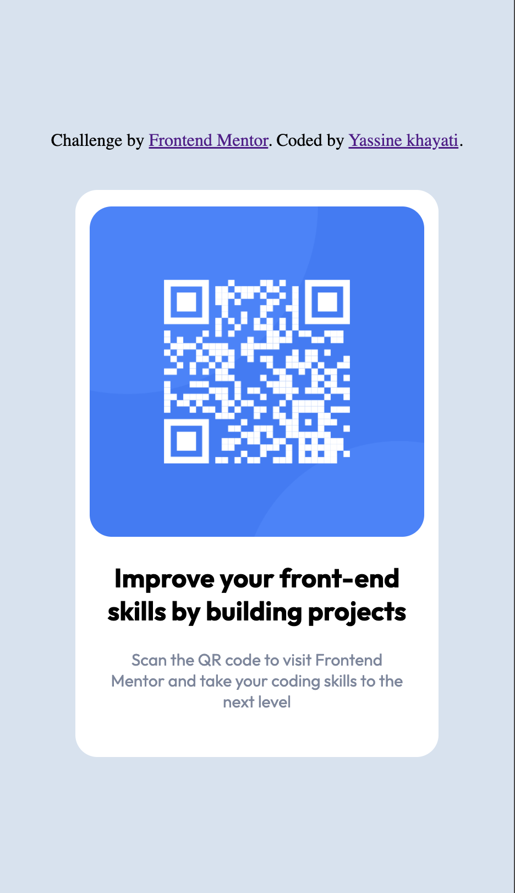

# Frontend Mentor - QR code component solution

This is a solution to the [QR code component challenge on Frontend Mentor](https://www.frontendmentor.io/challenges/qr-code-component-iux_sIO_H). Frontend Mentor challenges help you improve your coding skills by building realistic projects. 

## Table of contents

- [Overview](#overview)
  - [Screenshot](#screenshot)
  - [Links](#links)
- [My process](#my-process)
  - [Built with](#built-with)
  - [What I learned](#what-i-learned)
  - [Continued development](#continued-development)
  - [Useful resources](#useful-resources)
- [Author](#author)
- [Acknowledgments](#acknowledgments)

**Note: Delete this note and update the table of contents based on what sections you keep.**

## Overview

### Screenshot



### Links
- Live Site URL: [https://strong-mochi-9d21ef.netlify.app/#]

## My process
-A trial and error process where I:
HTML:
    - Set up the Skeleton via HTML (addedimage, and the two texts)
    - Added different div to contain the background, the image, and the texts
CSS:
    - First set up the white background on grey background
    -Adjusted the setting of the qr code image to fit within the white background
    - played with the proportions and the setting to fit the image inside the white background
    - Adjusted the font size, color and alignment of the texts
    - Adjusted the font of the texts
    - Played around with the padding and the margins of the texts so it resembles the provided design example
### Built with

- Semantic HTML5 markup
- CSS custom properties

### What I learned

- I learnt how to play around with margins, padding to get the results that I want
- I learnt how to use div containers to seperate the different elements of the webpage and style them appropriately
- I learnt how to adjust an image so it fits its parent background

```html that I am proud of
<div class="qrCode">
      
</div>
```
```css that I am proud of
.qrCode{
    height: 300px;
    width: 330px;
}
/* The image */
img{
    /* The display and margin 
    center it in the middle although 
    I don't understand these options */
    display: block;
    margin: auto;
    margin-top: 15px;
    width:92%;
    height:100%;
    border-radius: 20px;
}

### Continued development

I am hoping to practise more of my HTML and CSS skills in other projects and learn to apply more complex elements. Then I hope to start learning Javascript
After I feel comfortable with Front-end elements, I want to move to learning Back-end


### Useful resources

- [ChatGPT](https://chat.openai.com/) - ChatGPT is really great at explaining concepts while I am learning them 
- [SmolJames HTML & CSS FUll course](https://www.youtube.com/watch?v=70T2GMDKl6M) - I watched this to get me started on HTML and CSS and I keep on referring back to the video for certain elements
## Author

- Website - [Yassine Khayati](https://substack.com/@yassinekhayati?utm_source=profile-page)
## I don't have a website yet, but here is my substack for some articles unrelated to coding that I wrote last summer
- Frontend Mentor - [@yourusername](https://www.frontendmentor.io/profile/yourusername)
- Twitter - [@@khayati_yassin](https://twitter.com/khayati_yassin)

**Note: Delete this note and add/remove/edit lines above based on what links you'd like to share.**

## Acknowledgments

Thank you for the Frontend mentor team for providing a nice landing challenge to practise HTML and CSS

